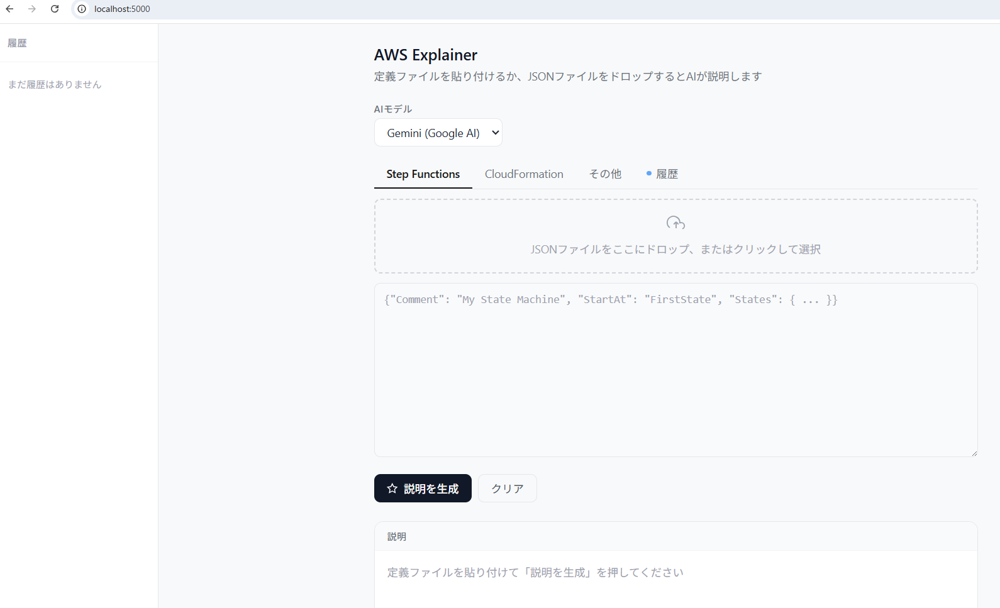

# AWS Explainer

AWS の定義ファイル（Step Functions、CloudFormation など）を貼り付けるか、  
JSON ファイルをドロップすると、AI がわかりやすく日本語で説明してくれるローカル Web ツール。

## 機能

- Step Functions / CloudFormation / その他の定義ファイルに対応  
- JSON ファイルのドラッグ&ドロップ読み込み  
- Gemini（Google AI Studio）/ Claude（Anthropic）の切り替え  
- 説明結果の Markdown レンダリング  
- 履歴機能（localStorage に自動保存、最大 20 件）  

## ディレクトリ構成

```
aws-explainer/
├── app.py            # Flask サーバー
├── .env              # GEMINI_API_KEY=xxx（要作成）
├── .gitignore
├── requirements.txt
└── frontend/
    └── index.html
```

```
## セットアップ

### 1. 仮想環境を有効化してパッケージをインストール

```bash
source ~/uvenv/py313/bin/activate
uv pip install flask flask-cors requests python-dotenv
```

### 2. `.env` ファイルを作成して API キーを設定

`.env`に API キーを設定。  

```
GEMINI_API_KEY=your_api_key_here
# ANTHROPIC_API_KEY=your_api_key_here  # Claude を使う場合
```

### 3. サーバー起動

```bash
python app.py
```

ブラウザで `http://localhost:5000` を開きます(今回はchrome)。

## 使い方

### 定義ファイルの取得（Step Functions の場合）

```bash
aws stepfunctions describe-state-machine \
  --state-machine-arn arn:aws:states:ap-northeast-1:ACCOUNT_ID:stateMachine:YOUR_STATE_MACHINE \
  --query 'definition' \
  --output text > definition.json
```

取得した `definition.json` をブラウザのドロップエリアに  
ドラッグ&ドロップして「説明を生成」を押下。  

## 構成画面
 

## AI モデルについて

| | Gemini 2.5 Flash | Claude Sonnet |
|---|---|---|
| 速度 | 速い | やや遅い |
| 説明の詳しさ | 十分 | より丁寧・構造的 |
| 日本語品質 | 自然 | 非常に自然 |
| 推論の深さ | 良好 | やや深い |

### セキュリティの観点

**Gemini（Google AI Studio）**
- 無料枠はレートリミットあり（RPM: 5、RPD: 20）
- 商用利用時のデータ扱いに注意
- 社内利用の場合は Vertex AI 経由が望ましい

**Claude（Anthropic）**
- 商用 API 利用時はモデル学習に使用しない
- データ保持ポリシーが明確

## トラブルシューティング

### 使用可能なモデル名の確認

```bash
curl "https://generativelanguage.googleapis.com/v1beta/models?key=YOUR_API_KEY"
```

### API 接続確認

```bash
curl -s "https://generativelanguage.googleapis.com/v1beta/models/gemini-2.5-flash:generateContent?key=YOUR_API_KEY" \
  -H "Content-Type: application/json" \
  -d '{"contents":[{"parts":[{"text":"日本語で「こんにちは」と返してください"}]}]}'
```

### Flask エンドポイントの確認

```bash
curl -s -X POST http://localhost:5000/explain \
  -H "Content-Type: application/json" \
  -d '{"definition": "test", "type_label": "Step Functions", "model": "gemini"}'
```

### 503エラー の対処

会社のプロキシやファイアウォールが Google の API への通信をブロックしている可能性がある。  
上記の `curl` コマンドで直接 API に疎通できるか確認を行った。
